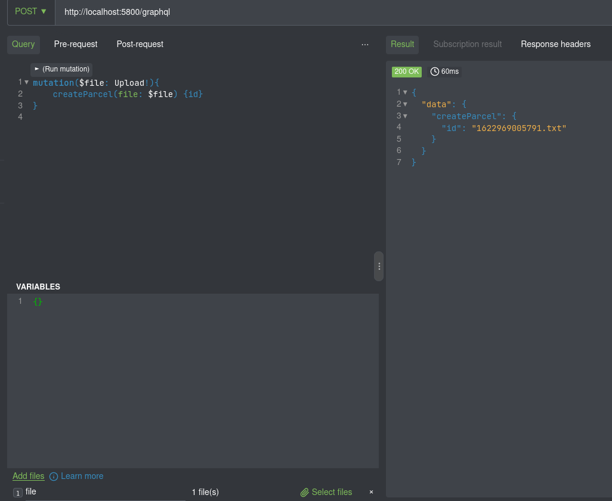
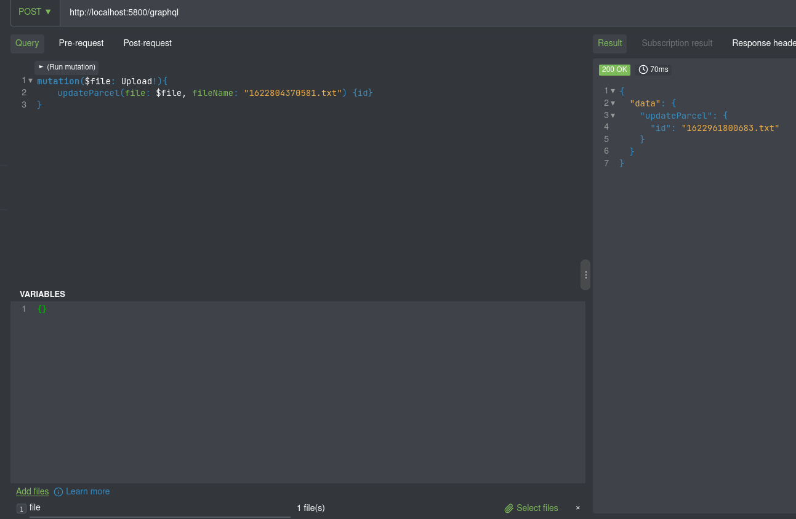

# Greetings!

## How to run this project:

1. Clone or download the repo.
2. run the command <i>npm install</i> on the root, server and client folders respectively.
3. on the root folder, run the command <i>npm run dev</i>

- when testing & before trying to fetch data note that the server is running, if not simply refresh the page and it should work by then

- you can use Altair to upload and update text files with GraphQL:
- Upload example:
   
  

 

- Update example:
   
  
